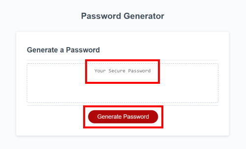
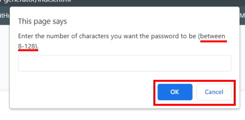
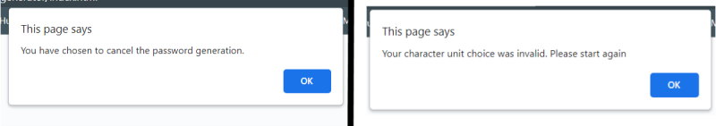
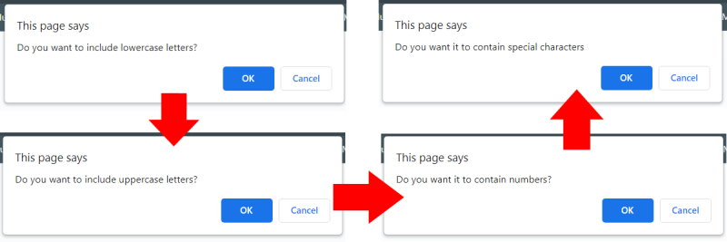

# password-generator

# Password Generator

## Description

My motivation with developing a Random Password Generator was the necessity for increased security levels when accessing sensitive data.It solves the issue of reusing the same password over mutliple accounts, and due to randomised format means it doesn't necessarily follow strict pattern for character choice.

I learnt how to randomise character choice and how to push this to a browser page. I got practice at writing else if statements and, do feel like there is better way to do it but, at this point time I was unable to do this in the allocated timeline for the project.

---

## Table of Contents (Optional)

- [Usage](#usage)
- [Credits & Resources](#credits--resources)
- [License](#license)
- [Problems & Resolutions](#problems--resolutions)

---

## Usage

To start the random password generation click the "Generate Password button". You are then taken through a series of prompts.

The first prompt asks you to enter a password character length choice between 8-128. 

If you enter an invalid option or hit the cancel box you are prompted with:

If you enter a valid option you are met with these prompts in succession:

Once you've made your choices the randomly generated password will appear in the box! 

To view the deployed application just follow the link below!

INSERT GITHUB LINK

---

## Credits & Resources

I used the following online resources to try and educate myself on different aspects of the code I was writing. This is not an exhaustive list.

* [https://www.codegrepper.com/code-examples/javascript/how+to+console.log+a+random+item+from+an+array+javascript](https://www.codegrepper.com/code-examples/javascript/how+to+console.log+a+random+item+from+an+array+javascript)
* [https://www.universalclass.com/articles/computers/javascript/user-input-and-output-in-javascript.htm](https://www.universalclass.com/articles/computers/javascript/user-input-and-output-in-javascript.htm)
* [https://developer.mozilla.org/en-US/docs/Web/API/Window/prompt](https://developer.mozilla.org/en-US/docs/Web/API/Window/prompt)
* [https://openjavascript.info/2022/03/14/random-password-generator-using-javascript/](https://openjavascript.info/2022/03/14/random-password-generator-using-javascript/)
* [https://www.codegrepper.com/code-examples/javascript/how+to+console.log+a+random+item+from+an+array+javascript](https://www.codegrepper.com/code-examples/javascript/how+to+console.log+a+random+item+from+an+array+javascript)
* [https://www.programiz.com/javascript/examples/generate-random-strings#:~:text=random()%20method%20is%20used,a%20random%20character%20is%20generated.](https://www.programiz.com/javascript/examples/generate-random-strings#:~:text=random()%20method%20is%20used,a%20random%20character%20is%20generated.)

In addition to this I sought help to resolve my for loop with the assistance of AskBCS, the person explained the errors and what I could do correct them. This is detailed further below.

---

## License

I used a standard MIT license for this, which can be viewed below:

INSERT GITHUB LINK

---

## Problems & Resolutions

I had an issue with my final for statement which would determine the output of randomised characters. What I originally had is passted below:

    var password = [];
      
    for (i = 0; i = passwordLength; i++); {
        var passwordChars = Math.floor(Math.random() * userCharChoices.length[i]);
        password.push(passwordChars);
    }

The problem with this code is it is simply outputting numbers and no characters, and was drawing on an unnesscary index. The final code used is:

    for (i = 0; i < passwordLength; i++) {
      var passwordNumbers = Math.floor(Math.random() * userCharChoices.length);
      var passwordChars = userCharChoices.charAt(passwordNumbers);
        console.log(passwordChars);
        password.push(passwordChars);
    } console.log(password);

This sees the passwordNumbers varibale assigned to math floor, while the passwordChars variable is reassigned to a different solution.

A final step was introduced at the bottom to push the password to the browser:

    return password.join("");
